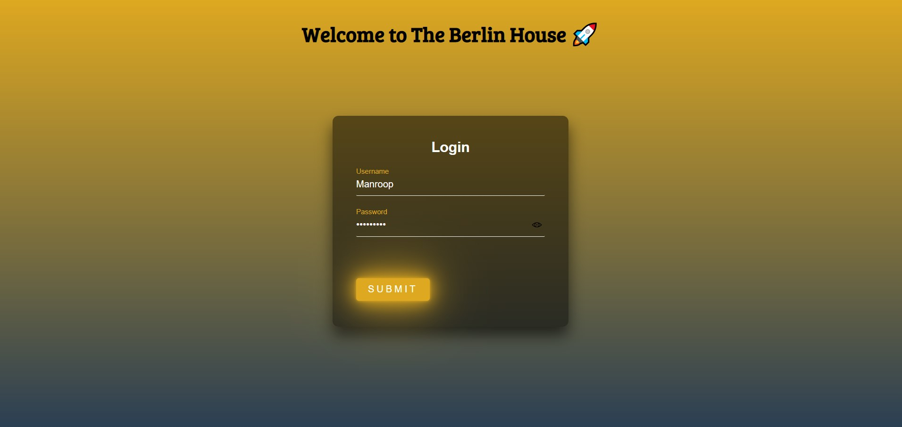
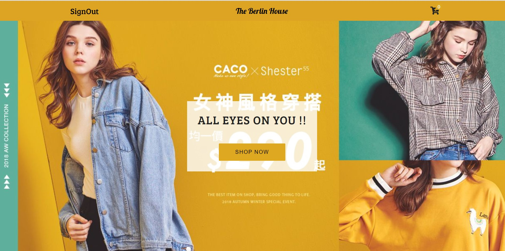
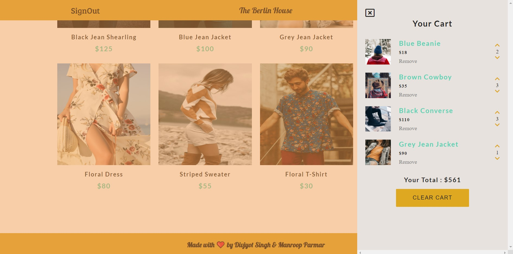

# THE BERLIN HOUSE

## Website: [TheBerlinHouse](https://divjyotsingh.github.io/TheBerlinHouse/index.html)
 

 

### This is the repo for the Ecommerce Project : The Berlin House 

 

 #### This project has been built using Html , Css and Vanilla Javascript. In our Ecommerce Store, we provide the users with the functionality of loging into the Berlin House, Followed by checking out all the products and adding the ones they would like to buy in a stylized Cart, where they can also add, remove , or update the count of items they would like to purchase from the store. Go Ahead and Explore The Berlin House 🍺
  

 ## Setup
In order to take down The Berlin House on your Local Systems, all you have to do is fork this project, clone it on your systems, copy the path of the index.html file and paste it on which ever browser you love working on. Happy Coding 🚀🚀

## Contributors ✨

The wonderful developers who worked hard enough to create this beautiful Berlin House. Cheers 🍺

<table>
  <tr>
    <td align="center"><a href="https://www.linkedin.com/in/divjyot-singh-517793195/"> <b>Divjyot Singh</b></a> <a href="https://github.com/developer-student-club-thapar/officialWebsite/commits?author=DivjyotSingh" title="Code">💻</a> <a href="#design-DivjyotSingh" title="Design">🎨</a>
    <a href="#maintenance-DivjyotSingh" title="Maintenance">🚧</a></td>
    <td align="center"><a href="https://www.linkedin.com/in/manroop-parmar/"> <b>Manroop Parmar</b></a> <a href="https://github.com/developer-student-club-thapar/officialWebsite/commits?author=bughunter9" title="Code">💻</a> <a href="#design-bughunter9" title="Design">🎨</a> <a href="#maintenance-bughunter9" title="Maintenance">🚧</a></td>

  </tr>
</table>
